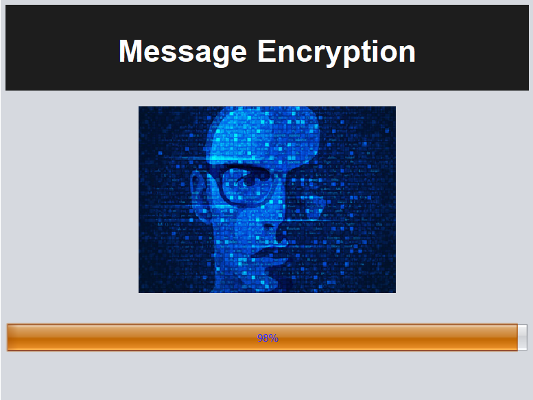
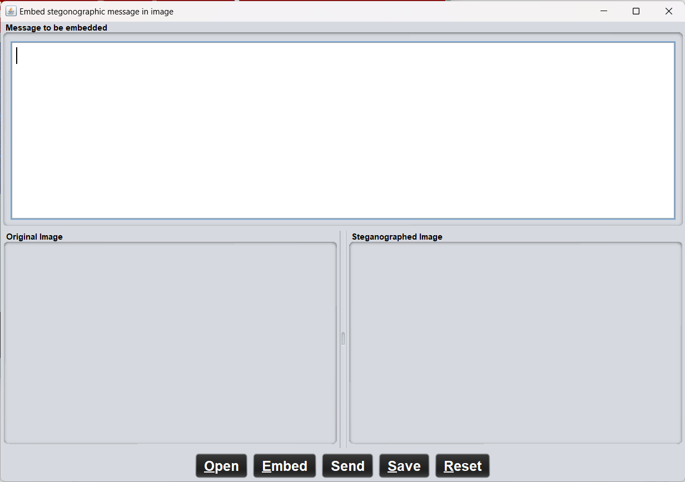
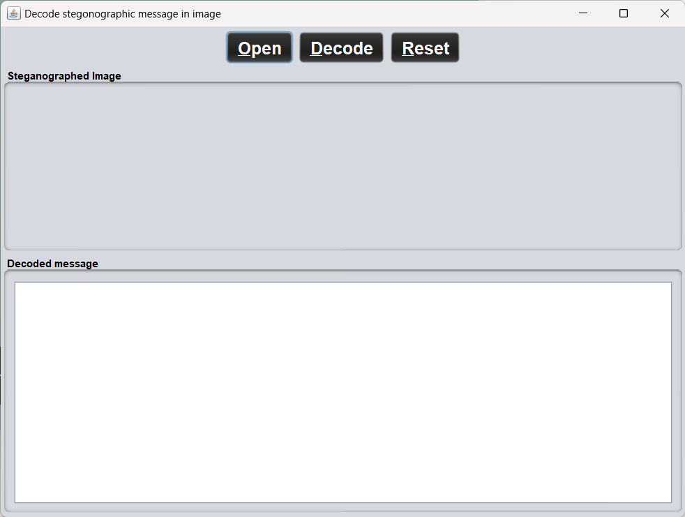
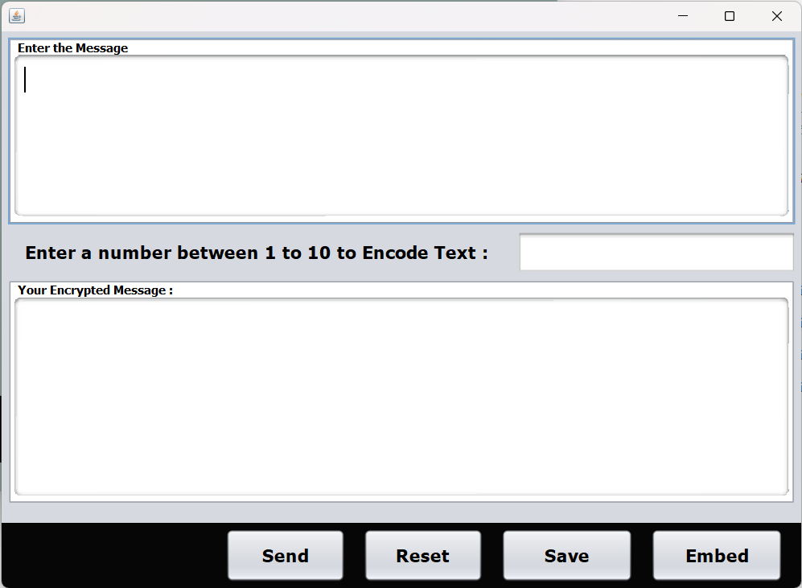
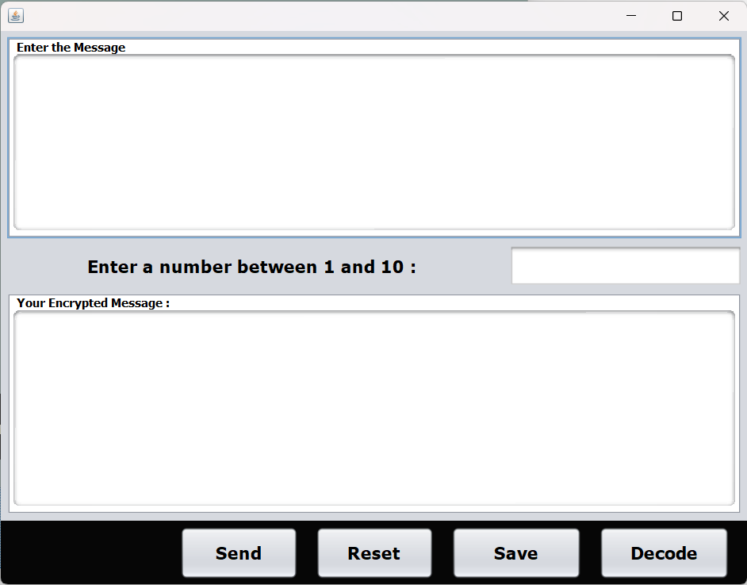
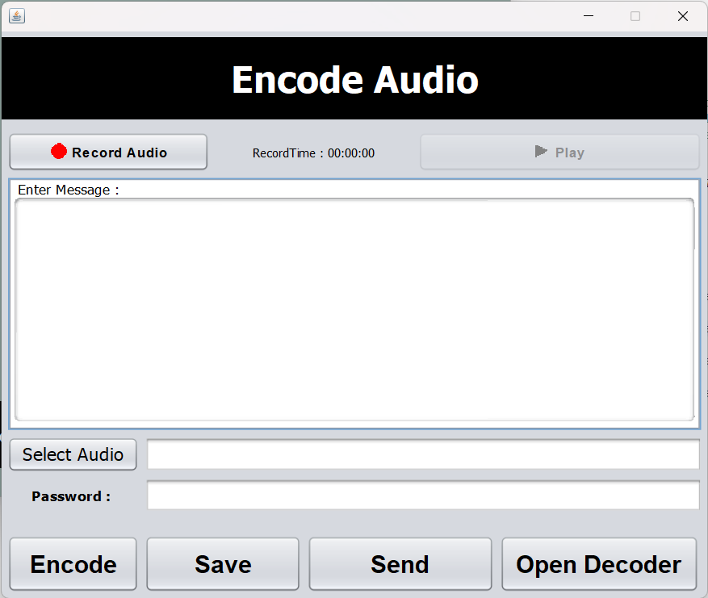
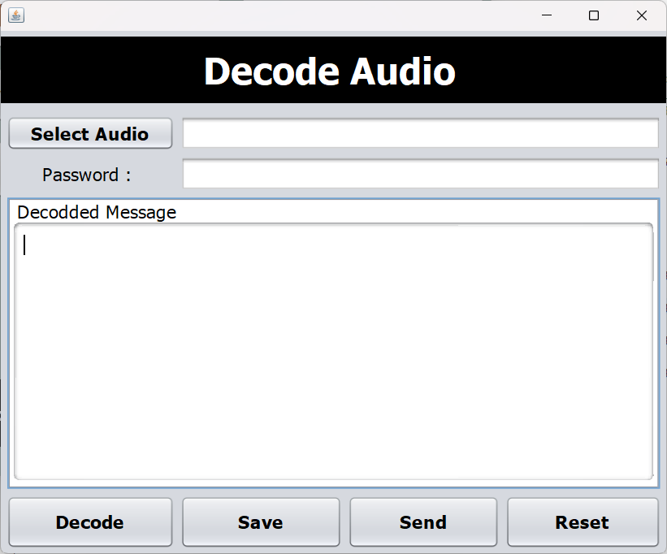
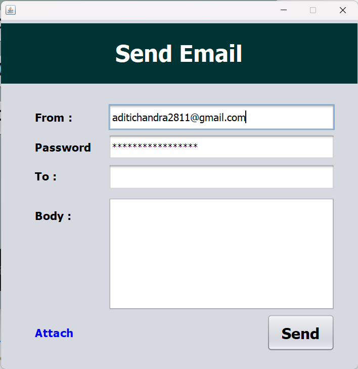

# Stenography

This is a stenography program that can be used to hide texts in images, texts and audio. It is written in Java.

## Login page

## Opening 

## Home

## Image

### Encoding image

### Decoding image

## Text

### Encoding text

### Decoding text

## Audio

### Encoding audio

### Decoding audio

## Mail

