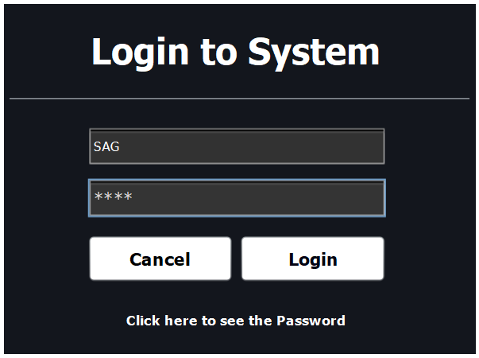
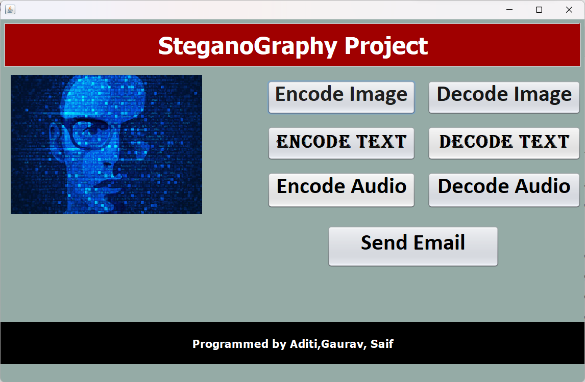
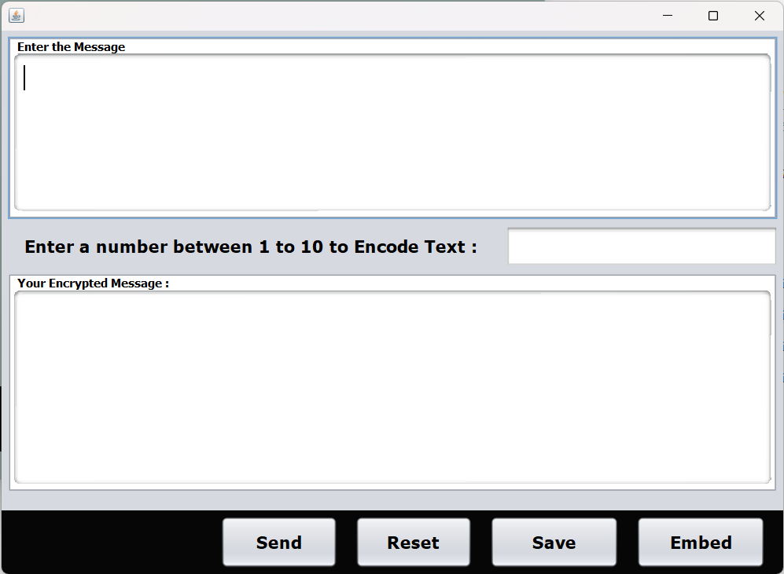
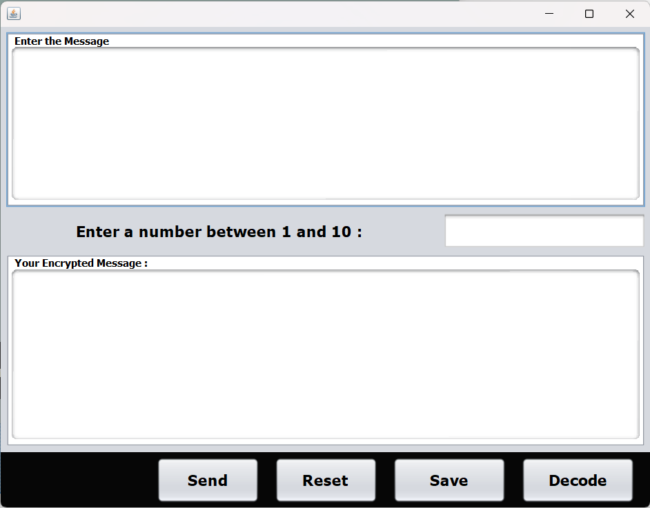
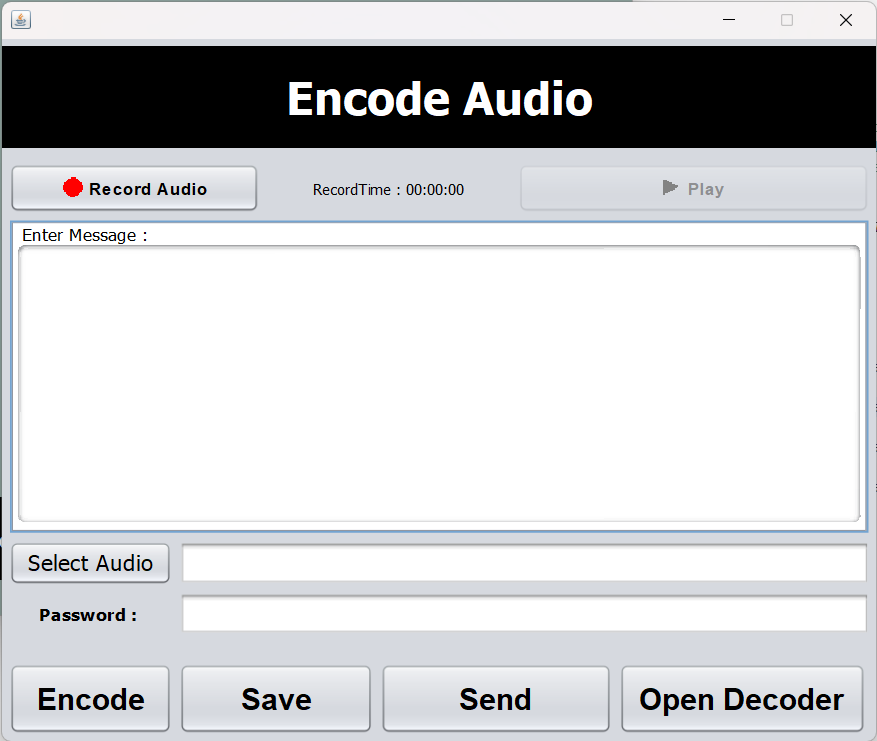
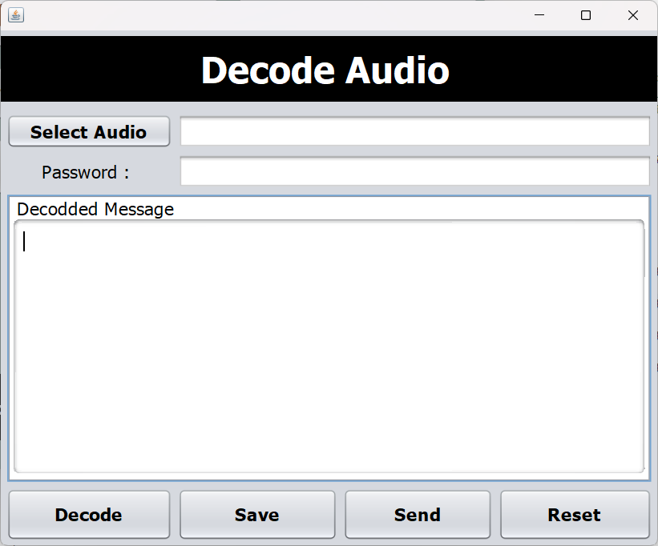
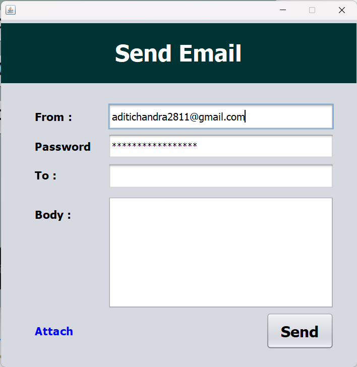

# stenography

This is a stenography program that can be used to hide texts in images, texts and audio. It is written in Java.

##Login page

##Home

##Image

###Encoding image

###Decoding image

##Text

###Encoding text

###Decoding text

##Audio

###Encoding audio

###Decoding audio

##Mail

